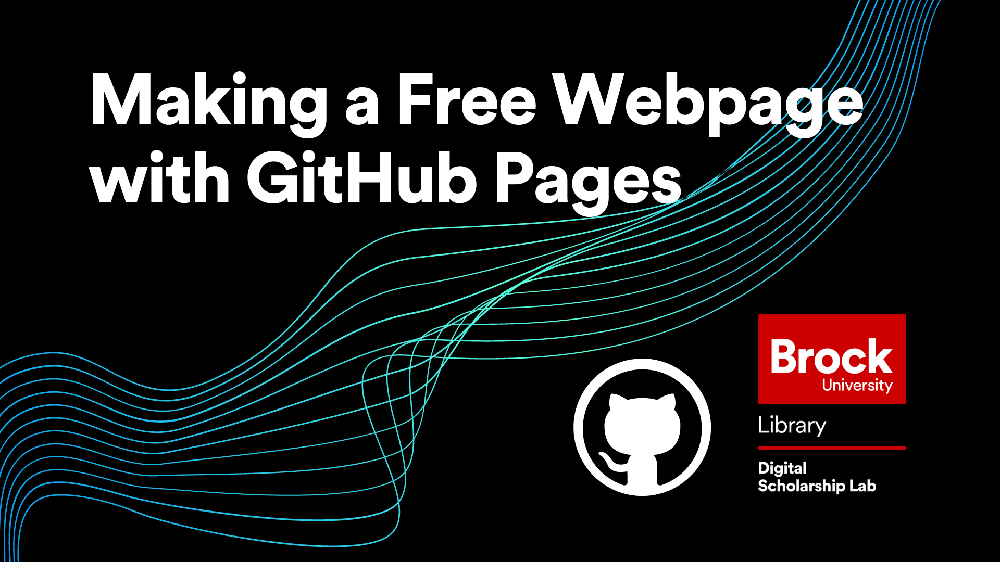

# Making a Free Webpage with GitHub Pages
In this workshop, attendees will learn how to host free webpages on GitHub.  The process to make a basic, single page site is surprisingly easy and provides an excellent alternative to paid hosting options as not only is it free, but it allows for full control over the site at all times and it will exist forever!  This workshop is the third in the GitHub Workshop Series offered by the Brock University Digital Scholarship Lab.

A basic understanding of using repositories in GitHub is recommended for this workshop.  

*Estimated workshop length: 1.5 hours*

----

## Setup
In preparation for this workshop, you will need the following: 

- A GitHub account which you can get by clicking the "Sign Up" button at the top right of [https://github.com/](https://github.com/).
- A GitHub repository that you will use to build a GitHub pages site.  A new repository with just a README.md file will work fine.
- An image file (jpg or png work best) to add to your site.  

----

## Helpful Materials
[Markdown Cheat Sheet](https://www.markdownguide.org/cheat-sheet/): This is a helpful cheat sheet showing the common Markdown syntax.  Excellent for experienced users and beginners alike!  

----

## Next Steps

After completing this workshop, the recommended next steps are:

 - Try making another site from scratch.  Practicing the steps and getting more comfortable with Markdown will help keep the knowledge gained in the workshop from fading away!
 - Check out [Hugo](https://gohugo.io/) and [Jekyll](https://jekyllrb.com/) to learn more about more advanced theme options.
 - Consider attending the "Automating tasks with GitHub Actions" workshop which is next in The GitHub Workshop Series.  

----
 

  
**This workshop is brought to you by the Brock University Digital Scholarship Lab.  For a listing of our upcoming workshops go to [Experience BU](https://experiencebu.brocku.ca/organization/dsl) if you are a Brock affiliate or [Eventbrite page](https://www.eventbrite.ca/o/brock-university-digital-scholarship-lab-21661627350) for external attendees.**

